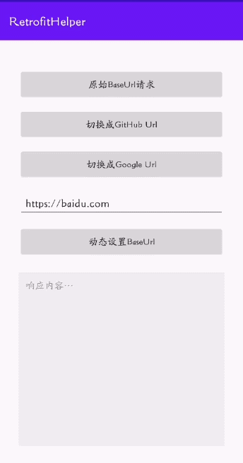

# RetrofitHelper


[](https://raw.githubusercontent.com/jenly1314/RetrofitHelper/master/app/release/app-release.apk)
[](https://repo1.maven.org/maven2/com/github/jenly1314/retrofit-helper)
[](https://jitpack.io/#jenly1314/RetrofitHelper)
[](https://circleci.com/gh/jenly1314/RetrofitHelper)
[](https://android-arsenal.com/api?level=16)
[](https://opensource.org/licenses/mit-license.php)

RetrofitHelper for Android 是一个为 Retrofit 提供便捷配置多个BaseUrl相关的扩展帮助类。

## 主要功能介绍
- [x] 支持配置多个BaseUrl
- [x] 支持动态改变BaseUrl
- [x] 支持动态配置超时时长
- [x] 支持添加公共请求头
- [x] 支持请求响应进度监听

## Gif 展示


> 你也可以直接下载 [演示App](https://raw.githubusercontent.com/jenly1314/RetrofitHelper/master/app/release/app-release.apk) 体验效果

## 引入

### Gradle:

1. 在Project的 **build.gradle** 或 **setting.gradle** 中添加远程仓库

    ```gradle
    repositories {
        //...
        mavenCentral()
    }
    ```

2. 在Module的 **build.gradle** 里面添加引入依赖项

    ```gradle
    // AndroidX 版本
    implementation 'com.github.jenly1314:retrofit-helper:1.1.0'
    ```

> 因为 **RetrofitHelper** 依赖的 **retrofit** 只在编译时有效，所以在使用时，您的项目还需依赖 **retrofit** 才能正常使用。

## 使用

### 示例

#### 主要集成步骤代码示例

Step.1 需使用JDK8编译，在你项目中的build.gradle的android{}中添加配置：
```gradle
compileOptions {
    targetCompatibility JavaVersion.VERSION_1_8
    sourceCompatibility JavaVersion.VERSION_1_8
}

```

Step.2 通过RetrofitHelper初始化OkHttpClient，进行初始化配置
```kotlin
// 通过RetrofitHelper创建一个支持多个BaseUrl的 OkHttpClient
// 方式一
val clientBuilder = RetrofitHelper.getInstance()
            .createClientBuilder()
            //...你自己的其他配置
            
// 方式二
val okHttpClient = RetrofitHelper.getInstance()
            .with(clientBuilder)
            //...你自己的其他配置
            .build()

```

```kotlin
// 完整示例
val okHttpClient = RetrofitHelper.getInstance()
            .createClientBuilder()
            .addInterceptor(LogInterceptor())
            .build()
val retrofit = Retrofit.Builder()
            .baseUrl(Constants.BASE_URL)
            .client(okHttpClient)
            .addConverterFactory(GsonConverterFactory.create(Gson())) 
            .build()
```

Step.3 定义接口时，通过注解标记对应接口，支持动态改变 BaseUrl相关功能
```kotlin
 interface ApiService {
    
     /**
      * 接口示例，没添加任何标识，和常规使用一致
      * @return
      */
     @GET("api/user")
     fun getUser(): Call<User>
     
     /**
      * Retrofit默认返回接口定义示例，添加 DomainName 标示 和 Timeout 标示
      * @return
      */
     @DomainName(domainName) // domainName 域名别名标识，用于支持切换对应的 BaseUrl
     @Timeout(connectTimeout = 15,readTimeout = 15,writeTimeout = 15,timeUnit = TimeUnit.SECONDS) //超时标识，用于自定义超时时长
     @GET("api/user")
     fun getUser(): Call<User>

     /**
      * 动态改变 BaseUrl
      * @return
      */
     @BaseUrl(baseUrl) // baseUrl 标识，用于支持指定 BaseUrl
     @GET("api/user")
     fun getUser(): Call<User>
     
     //--------------------------------------

     /**
      * 使用 RxJava 返回接口定义示例，添加 DomainName 标示 和 Timeout 标示
      * @return
      */
     @DomainName(domainName) // domainName 域名别名标识，用于支持切换对应的 BaseUrl
     @Timeout(connectTimeout = 20,readTimeout = 10) // 超时标识，用于自定义超时时长
     @GET("api/user")
     fun getUser(): Observable<User>

    /**
     * 下载；可通过 RetrofitHelper.getInstance().addResponseListener(key, listener) 监听下载进度
     */
    @ResponseProgress(key) // 支持响应进度监听，自定义配置监听的key
    @Streaming
    @GET("api/download")
    fun download(): Call<ResponseBody>
 }

```

Step.4 添加多个 BaseUrl 支持
```kotlin
        // 添加多个 BaseUrl 支持 ，domainName为域名别名标识，domainUrl为域名对应的 BaseUrl，与上面的接口定义表示一致即可生效
        RetrofitHelper.getInstance().putDomain(domainName,domainUrl)
```
```kotlin
        // 添加多个 BaseUrl 支持 示例
        RetrofitHelper.getInstance().apply {
            //GitHub baseUrl
            putDomain(Constants.DOMAIN_GITHUB,Constants.GITHUB_BASE_URL)
            //Google baseUrl
            putDomain(Constants.DOMAIN_GOOGLE,Constants.GOOGLE_BASE_URL)
        }
```

Step.5 添加进度监听

```kotlin
        // 添加请求进度监听：key默认为请求的url，也可以通过 {@link RequestProgress} 来自定义配置接口对应的key；自定义配置的key优先级高于默认的url
        RetrofitHelper.getInstance().addRequestListener(key, object: ProgressListener{
            override fun onProgress(currentBytes: Long, contentLength: Long, completed: Boolean) {
                
            }

            override fun onException(e: Exception) {
                
            }
        })
```

```kotlin
        // 添加响应进度监听：key默认为请求的url，也可以通过 {@link ResponseProgress} 来自定义配置接口对应的key；自定义配置的key优先级高于默认的url
        RetrofitHelper.getInstance().addResponseListener(key, object: ProgressListener{
            override fun onProgress(currentBytes: Long, contentLength: Long, completed: Boolean) {
                
            }

            override fun onException(e: Exception) {
                
            }
        })
```

#### RetrofitHelper 说明
```java
/**
 * Retrofit帮助类
 * 
 * 主要功能介绍：
 *      1.支持管理多个 BaseUrl，且支持运行时动态改变
 *      2.支持接口自定义超时时长，满足每个接口动态定义超时时长
 *      3.支持添加公共请求头
 *
 * RetrofitHelper中的核心方法
 *
 * {@link #createClientBuilder()} 创建 {@link OkHttpClient.Builder}初始化一些配置参数，用于支持多个 BaseUrl
 *
 * {@link #with(OkHttpClient.Builder)} 传入 {@link OkHttpClient.Builder} 配置一些参数，用于支持多个 BaseUrl
 *
 * {@link #setBaseUrl(String)} 和 {@link #setBaseUrl(HttpUrl)} 主要用于设置默认的 BaseUrl。
 *
 * {@link #putDomain(String, String)} 和 {@link #putDomain(String, HttpUrl)} 主要用于支持多个 BaseUrl，且支持 BaseUrl 动态改变。
 *
 * {@link #setDynamicDomain(boolean)} 设置是否支持 配置多个BaseUrl，且支持动态改变，一般会通过其他途径自动开启，此方法一般不会主动用到，只有在特殊场景下可能会有此需求，所以提供此方法主要用于提供更多种可能。
 *
 * {@link #setHttpUrlParser(HttpUrlParser)} 设置 HttpUrl解析器 , 当前默认采用的 {@link DomainParser} 实现类，你也可以自定义实现 {@link HttpUrlParser}
 *
 * {@link #setAddHeader(boolean)} 设置是否添加头，一般会通过{@link #addHeader(String, String)}相关方法自动开启，此方法一般不会主动用到，只有特殊场景下会有此需求，主要用于提供统一控制。
 *
 * {@link #addHeader(String, String)} 设置头，主要用于添加公共头消息。
 *
 * {@link #addHeaders(Map)} 设置头，主要用于设置公共头消息。
 * 
 * {@link #addRequestListener(String, ProgressListener)} 添加请求监听。
 * 
 * {@link #addResponseListener(String, ProgressListener)} 添加响应监听。
 * 
 * 这里只是列出一些对外使用的核心方法，和相关的简单说明。如果想了解更多，可以查看对应的方法和详情。
 *
 * @author <a href="mailto:jenly1314@gmail.com">Jenly</a>
 */
public final class RetrofitHelper{
    //...
}

```

#### 特别说明
```kotlin
//通过setBaseUrl可以动态改变全局的 BaseUrl，优先级比putDomain(domainName,domainUrl)低，谨慎使用
RetrofitHelper.getInstance().setBaseUrl(dynamicUrl)
```

更多使用详情，请查看[app](app)中的源码使用示例或直接查看[API帮助文档](https://jenly1314.github.io/RetrofitHelper/api/)

## 相关推荐

- [BaseUrlManager](https://github.com/jenly1314/BaseUrlManager) BaseUrl管理器，主要打测试包时，一个App可动态切换到不同的开发环境或测试环境。
- [MVVMFrame](https://github.com/jenly1314/MVVMFrame) 一个基于Google官方推出的JetPack构建的MVVM快速开发框架。

<!-- end -->

## 版本日志

#### v1.1.0：2023-1-4
*  新增支持请求响应进度监听

#### [查看更多版本日志](CHANGELOG.md)

## 赞赏
如果你喜欢RetrofitHelper，或感觉RetrofitHelper帮助到了你，可以点右上角“Star”支持一下，你的支持就是我的动力，谢谢 :smiley:
<p>您也可以扫描下面的二维码，请作者喝杯咖啡 :coffee:

<div>
   
</div>

## 关于我

| 我的博客                                                                                | GitHub                                                                                  | Gitee                                                                                  | CSDN                                                                                 | 博客园                                                                            |
|:------------------------------------------------------------------------------------|:----------------------------------------------------------------------------------------|:---------------------------------------------------------------------------------------|:-------------------------------------------------------------------------------------|:-------------------------------------------------------------------------------|
| <a title="我的博客" href="https://jenly1314.github.io" target="_blank">Jenly's Blog</a> | <a title="GitHub开源项目" href="https://github.com/jenly1314" target="_blank">jenly1314</a> | <a title="Gitee开源项目" href="https://gitee.com/jenly1314" target="_blank">jenly1314</a>  | <a title="CSDN博客" href="http://blog.csdn.net/jenly121" target="_blank">jenly121</a>  | <a title="博客园" href="https://www.cnblogs.com/jenly" target="_blank">jenly</a>  |

## 联系我

| 微信公众号        | Gmail邮箱                                                                          | QQ邮箱                                                                              | QQ群                                                                                                                       | QQ群                                                                                                                       |
|:-------------|:---------------------------------------------------------------------------------|:----------------------------------------------------------------------------------|:--------------------------------------------------------------------------------------------------------------------------|:--------------------------------------------------------------------------------------------------------------------------|
| [Jenly666](http://weixin.qq.com/r/wzpWTuPEQL4-ract92-R) | <a title="给我发邮件" href="mailto:jenly1314@gmail.com" target="_blank">jenly1314</a> | <a title="给我发邮件" href="mailto:jenly1314@vip.qq.com" target="_blank">jenly1314</a> | <a title="点击加入QQ群" href="https://qm.qq.com/cgi-bin/qm/qr?k=6_RukjAhwjAdDHEk2G7nph-o8fBFFzZz" target="_blank">20867961</a> | <a title="点击加入QQ群" href="https://qm.qq.com/cgi-bin/qm/qr?k=Z9pobM8bzAW7tM_8xC31W8IcbIl0A-zT" target="_blank">64020761</a> |

<div>
   
</div>

